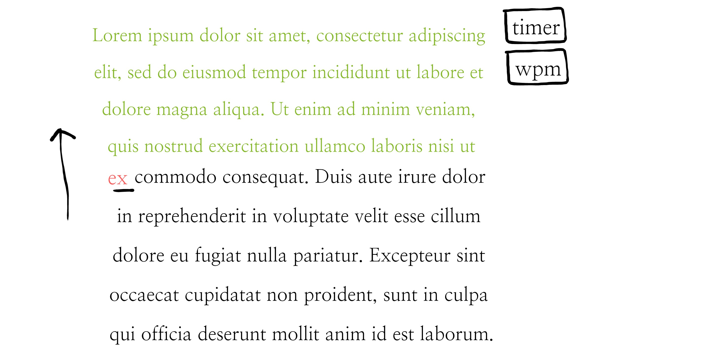

# Type-Faster

This project is a simple game to improve people's typing speed. Blocks of text will appear at the bottom of the screen and will move slowly to the top of the screen. The player must type out the words shown before a line hits the top of the page; the game is over and the player has lost if a line reaches the top and the user has not already typed it out.

## Functionality and MVPS

This game will have the following functionality and features:

- [ ] Text appearing at the bottom of the screen and moving towards the top
- [ ] Text will move faster as the game progresses
- [ ] Player will know if they've spelled a word correctly or incorrectly by a change in color of the text
- [ ] Player can set an initial speed mode: Easy, Medium, Difficult
- [ ] Player will know their final wpm rate of typing

Bonus: 
  
- [ ] Player will see their wpm rate update in real time
- [ ] Player can see "stats" like what letter combinations they did better and worse on
- [ ] Player can paste a body of text that they can practice typing out
  
## Wireframe

I have created a simple wireframe to capture the design layout of this game on the browser:

## Architecture & Technology

This project will heavily rely on web APIs and DOM manipulation. Depending on whether I decide to add animations and other effects to the game, other technologies may be added.

## Implementation Timeline

Day 1: Text authentication
  - Have text appear on the page
  - Respond to user input (changing colors depending on if the user types correctly or incorrectly)
  
Day 2: Scrolling Text
  - Have text appear on the page, scrolling from top to bottom
  - As soon as the top-most line hits the top of the viewport, an alert pops up that the user has lost/the game is over.
  
 Day 3: Incorporate more game logic
  - Implement easy, medium, difficult speed options for user to select
  - wpm calculator to display aggregate wpm at loss of game
  
 Day 4: Styling
  - Prettify the layout of the game
  
 Day 5: Testing for bugs
  - Take time to debug any issues and look for edge cases
  - Work on more logic, styling, and other issues that arise
  
